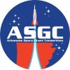

Hendrix College is very excited to host a total solar eclipse viewing event on <b>April 8, 2024</b>. Students, staff, faculty, alumni, and friends of the college are invited to gather at the <b>Young-Wise Memorial Stadium</b> from <b>12-4pm</b>.

{: height="250" width="400"}

There will be safe viewing opportunities with free eclipse glasses, telescopes with solar filters, and projections of the Sun. Join us for games, food, merchandise, music, and art to make the day a celebration to remember.

Food trucks - located in the horseshoe drive in front of the pool

<li><a href="https://www.spudlovear.com/">Spud Love</a></li>
<li><a href="https://www.cbrzcatering.com/">CBRZ Catering</a></li>
<li><a href="https://www.facebook.com/phonzies1stop/">Phonzie's 1stop</a></li>
<li><a href="https://www.facebook.com/profile.php?id=100093005676065">Umm Numms Raspas</a></li>
<li><a href="https://www.loblollycreamery.com/">Loblolly Creamery</a></li>

&nbsp;
&nbsp;

<b>We would like to thank the following sponsors for this event:</b>

<ul>
    <li><a href="https://arkansasspacegrant.org/">Arkansas Space Grant Consortium</a></li>
    <li><a href="https://www.hendrix.edu/odyssey/">The Hendrix Odyssey Program</a></li>
    <li>Charles Prentiss Hough Odyssey Professor sponsors</li>
</ul>
