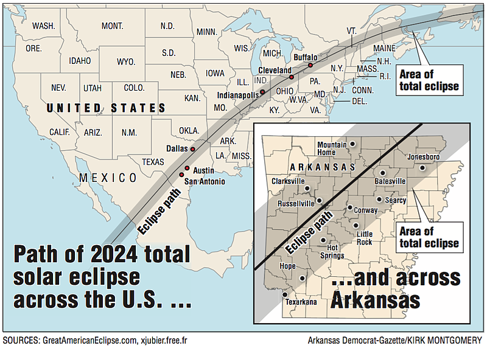
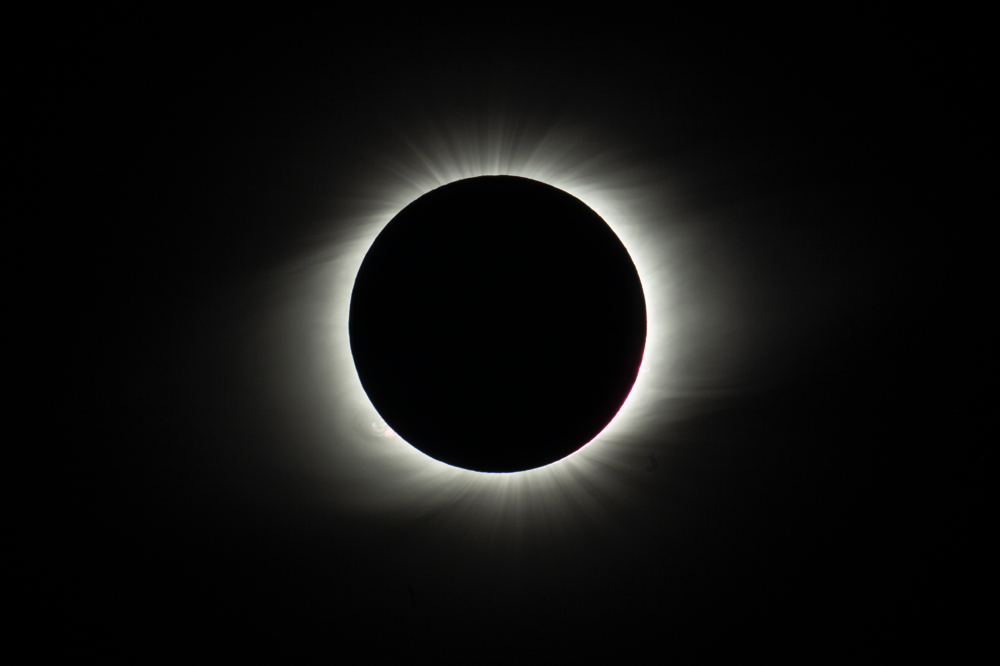
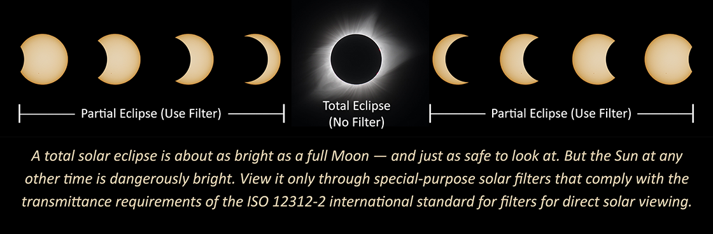
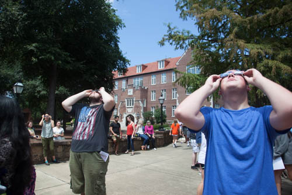

A solar eclipse happens when the Moon is directly between our Sun and Earth, causing the Moon to cast a shadow onto Earth. Because the Earth, Moon, and Sun are moving, the shadow traces a path across the Earth. 

<iframe width="560" height="315" src="https://www.youtube.com/embed/sOpYoO_SK7o" title="YouTube video player" frameborder="0" allow="accelerometer; autoplay; clipboard-write; encrypted-media; gyroscope; picture-in-picture; web-share" allowfullscreen></iframe>

This area is called the "path of totality." Only people inside this path will see the Sun completely blocked from view by the Moon. Hendrix College is lucky to be inside the path of totality for the April 8, 2024 eclipse.

We will have 3 minutes and 53 seconds of totality.

{: height="250" width="400" align="center"}

The timeline at our location is:
- Start of partial eclipse at 12:33:53 pm CDT
- Start of total eclipse at 1:51:08 pm CDT
- Maximum total eclipse at 1:53:04 pm CDT
- End of total eclipse at 1:55:00 pm CDT
- End of partial eclipse at 3:11:39 pm CDT

 
 
 image courtesy of https://eclipse.aas.org/eye-safety

 [Safety First!!!](#link){: .btn .btn--warning} Please be aware that looking directly at the Sun during any time except totality can result in severe and permanent eye injury. Eclipse glasses, telescopes with solar filters, and other safe viewing methods will be available at the event.

Some links for further information on eclipses:
- <a href="https://solarsystem.nasa.gov/eclipses/home/">NASA Eclipse page</a>
- <a href="https://www.greatamericaneclipse.com/">Great American Eclipse page</a>
- <a href="https://eclipse.aas.org/eye-safety">American Astronomical Society, safe solar viewing page</a>

